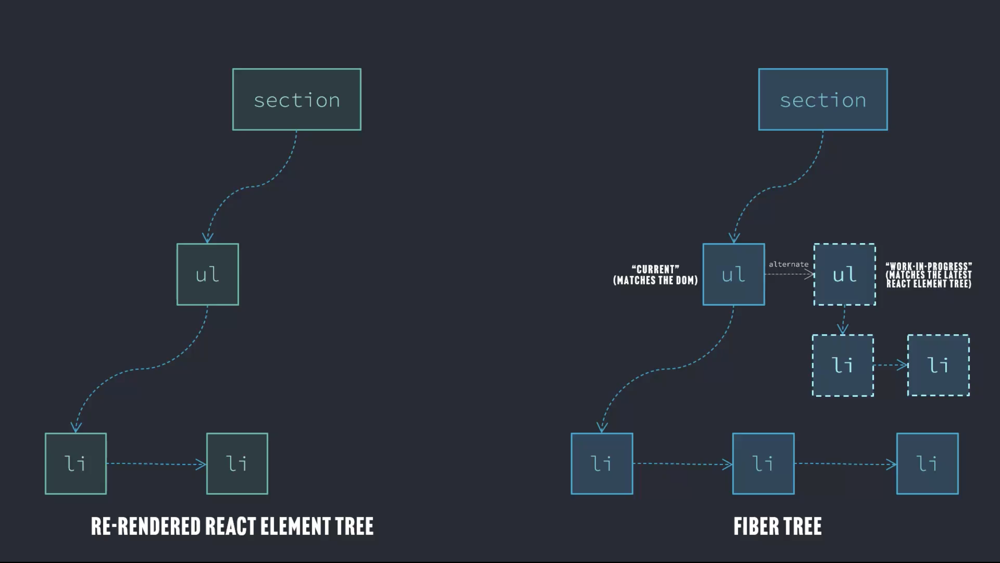

### Work-in-progress Nodes
The Fiber tree matches the current state of the DOM whereas React Element tree
is us telling React how we want the DOM to appear.

React uses the Fiber tree to figure out how the DOM tree could be updated with
minimal changes and then updates the DOM tree.

The current branch matches what is the DOM. The work in progress branches the
latest React Element tree.

The core idea is that one side of the tree has the original that matched the DOM
 and the other side of the tree has the work-in-progress, what the DOM should
look like. After that, React will update the DOM to look like the
work-in-progress, after which the work-in-progress becomes current.
